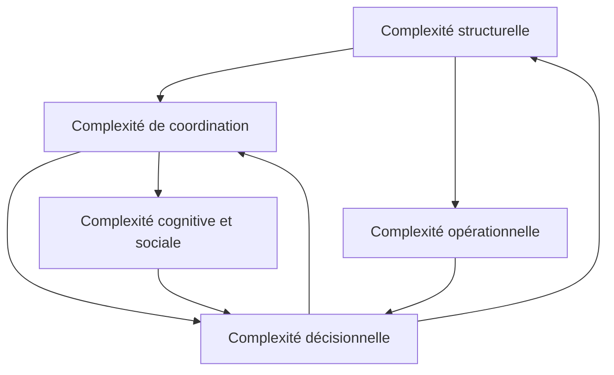

# 1. Les problèmes fondamentaux du développement logiciel à grande échelle

## Question de recherche

Quels problèmes apparaissent naturellement lorsqu'une organisation de développement logiciel passe de quelques équipes à plusieurs centaines de développeurs ?

## Intention du chapitre

Ce chapitre ne part pas des frameworks. Il ne cherche pas à expliquer SAFe, LeSS, Nexus, Scrum of Scrums, Team Topologies ou Flight Levels. Il cherche au contraire à identifier les contraintes structurelles auxquelles ces approches tentent, chacune à leur manière, de répondre.

L'hypothèse de départ est simple : au-delà d'une certaine échelle, les difficultés majeures d'une organisation logicielle ne proviennent pas d'abord d'un manque de méthode, mais de l'interaction entre complexité technique, complexité organisationnelle, incertitude produit et coûts de coordination.

Une organisation peut supprimer un framework. Elle ne peut pas supprimer les problèmes que ce framework essayait de traiter. Si ces problèmes restent présents, ils réapparaîtront sous d'autres formes : réunions informelles, escalades managériales, comités ad hoc, dépendances non visibles, arbitrages politiques, retards d'intégration, surcharge des experts, ou reporting déconnecté du travail réel.

## 1.1 Pourquoi l'échelle change la nature du problème

Le passage à l'échelle n'est pas seulement une augmentation quantitative du nombre de personnes. C'est un changement qualitatif dans la nature du système à piloter.

Une équipe de huit personnes peut souvent fonctionner avec une coordination largement implicite. Les membres partagent le même contexte, connaissent les décisions en cours, voient rapidement les effets de leur travail et peuvent résoudre de nombreux problèmes par conversation directe.

Une organisation de plusieurs centaines de développeurs ne dispose plus de cette propriété. Les personnes ne se connaissent pas toutes. Les équipes ne partagent pas le même contexte. Les décisions locales peuvent avoir des effets éloignés. Les dépendances deviennent difficiles à percevoir. Les priorités se concurrencent. Les délais ne sont plus seulement liés à la difficulté du travail, mais aussi aux files d'attente, validations, arbitrages et synchronisations nécessaires pour le faire progresser.

Le problème central devient donc moins :

> Comment augmenter la productivité individuelle des développeurs ?

et davantage :

> Comment concevoir un système organisationnel qui permette à des centaines de personnes de produire de la valeur de manière cohérente, sans que le coût de coordination ne consomme une part excessive de leur capacité ?

Cette distinction est fondamentale. Beaucoup de transformations échouent parce qu'elles tentent d'améliorer les équipes sans modifier les conditions systémiques dans lesquelles ces équipes opèrent.

## 1.2 Trois forces structurantes

Trois forces expliquent l'apparition des problèmes fondamentaux à grande échelle.

### 1.2.1 La croissance des interactions

Le nombre de relations potentielles entre personnes, équipes, composants et décisions croît plus vite que le nombre d'acteurs. Toutes ces relations ne sont pas actives en permanence, mais l'organisation doit néanmoins gérer un espace d'interactions beaucoup plus large.

Frederick Brooks a popularisé cette intuition dans *The Mythical Man-Month* : l'ajout de personnes à un projet logiciel n'augmente pas mécaniquement la capacité utile, car les coûts de communication, de formation et d'intégration augmentent également. Sa thèse n'est pas que toute croissance d'équipe est impossible, mais que le travail logiciel n'est pas parfaitement divisible en unités indépendantes.

À grande échelle, cette propriété se manifeste entre équipes. Plus le travail est couplé, plus les équipes doivent échanger, négocier, se synchroniser et attendre. Le coût n'est donc pas seulement le temps passé en réunion ; c'est aussi le délai introduit par l'incertitude, l'attente, la reprise de travail et la résolution tardive des incohérences.

### 1.2.2 Le couplage technique et organisationnel

Le développement logiciel est contraint par l'architecture du système produit. Lorsque deux équipes modifient des parties fortement couplées d'un même système, elles ne peuvent pas être réellement autonomes. Elles doivent coordonner les interfaces, les modèles de données, les contrats d'API, les tests, les migrations, les releases et parfois les décisions produit.

La loi de Conway, issue de l'article de Melvin Conway de 1968, exprime l'idée qu'il existe une correspondance forte entre les structures de communication d'une organisation et les systèmes qu'elle conçoit. Cette observation est souvent simplifiée, mais elle reste essentielle : organisation et architecture ne sont pas indépendantes.

Deux conséquences en découlent.

Premièrement, certaines difficultés attribuées à la méthode de travail sont en réalité des symptômes d'un couplage architectural. Une organisation peut ajouter des rituels de coordination, mais si l'architecture impose des dépendances permanentes, ces rituels ne feront que gérer le problème sans le réduire.

Deuxièmement, l'architecture peut être utilisée comme un levier organisationnel. Modularité, interfaces stables, plateformes internes, ownership clair et découpage par domaines peuvent réduire les besoins de coordination humaine.

### 1.2.3 L'incertitude et la variabilité

Le logiciel est une activité de conception et de découverte. Les besoins évoluent, les contraintes techniques sont parfois découvertes tardivement, les hypothèses produit peuvent être invalidées et les dépendances externes ne sont pas toujours maîtrisées.

Cette incertitude rend fragile toute planification détaillée à long terme. À petite échelle, les écarts peuvent être absorbés par ajustement local. À grande échelle, la variabilité locale se propage : un retard dans une plateforme, une API, une validation réglementaire ou une décision d'architecture peut affecter des dizaines d'équipes.

La conséquence est que les grandes organisations ont besoin à la fois d'alignement et d'adaptation. Trop peu de planification crée du chaos. Trop de planification crée une illusion de contrôle et augmente le coût du changement.

## 1.3 Taxonomie des problèmes fondamentaux

Les problèmes de développement logiciel à grande échelle peuvent être regroupés en cinq familles. Ces familles sont distinctes pour l'analyse, mais fortement interdépendantes dans la réalité.

Cette cartographie met en évidence un point important : il n'existe pas de problème isolé. Une décision de priorisation peut créer des dépendances. Une architecture couplée peut générer des réunions. Une mauvaise visibilité peut conduire à une gouvernance plus lourde. Une gouvernance trop lourde peut ralentir le feedback et aggraver l'incertitude.

## 1.4 Complexité structurelle

La complexité structurelle désigne la complexité intrinsèque du système logiciel et des actifs techniques partagés.

Elle inclut :

- l'architecture ;
- le couplage entre composants ;
- les modèles de données partagés ;
- les plateformes communes ;
- les environnements d'intégration ;
- les dépendances d'infrastructure ;
- les contraintes de sécurité, conformité et exploitation.

### Pourquoi elle apparaît

À mesure qu'un système logiciel évolue, il accumule des fonctionnalités, des exceptions, des interfaces, des contraintes historiques et des choix techniques difficiles à remettre en cause. Les grandes organisations travaillent rarement sur un système neuf. Elles opèrent sur des paysages applicatifs existants, souvent composés de générations techniques successives.

La complexité structurelle devient critique lorsque les équipes ne peuvent plus modifier une partie du système sans coordination avec plusieurs autres équipes. Le symptôme n'est pas seulement la complexité du code, mais l'augmentation du rayon d'impact d'une décision locale.

### Conséquences si elle n'est pas traitée

Une complexité structurelle non maîtrisée produit plusieurs effets :

- ralentissement du changement ;
- multiplication des dépendances ;
- difficulté à tester ;
- risque accru d'incidents ;
- besoin croissant de coordination humaine ;
- concentration de la connaissance chez quelques experts ;
- difficulté à attribuer clairement l'ownership.

Le danger est que l'organisation tente souvent de compenser cette complexité par davantage de processus. Or, si le problème est architectural, la réponse organisationnelle ne peut être qu'un palliatif.

### Tensions créées

La complexité structurelle crée une tension entre autonomie et cohérence. Donner de l'autonomie à des équipes travaillant sur un système fortement couplé peut accélérer localement les décisions, mais accroître globalement les conflits d'intégration. À l'inverse, centraliser toutes les décisions architecturales protège la cohérence, mais ralentit les équipes et surcharge les experts.

Le compromis durable consiste généralement à combiner des frontières techniques plus claires, des standards minimaux et une gouvernance d'architecture légère.

## 1.5 Complexité de coordination

La complexité de coordination apparaît lorsque plusieurs équipes doivent contribuer à des résultats communs tout en partageant des dépendances techniques, fonctionnelles ou opérationnelles.

Elle inclut :

- la coordination des dépendances ;
- la synchronisation des livraisons ;
- la gestion des arbitrages inter-équipes ;
- la résolution des blocages ;
- la planification des travaux transverses ;
- la coordination entre produit, architecture, sécurité, exploitation et développement.

### Pourquoi elle apparaît

À petite échelle, la coordination se fait souvent par proximité. À grande échelle, la proximité disparaît. Les équipes doivent alors disposer de mécanismes explicites pour rendre visibles leurs dépendances, intentions et contraintes.

La coordination devient critique lorsque le succès d'une équipe dépend régulièrement du travail d'autres équipes. Dans ce cas, la performance ne peut plus être comprise équipe par équipe : elle devient une propriété du réseau de dépendances.

### Conséquences si elle n'est pas traitée

Une coordination insuffisante produit :

- des surprises tardives ;
- des retards d'intégration ;
- des conflits de priorité ;
- des équipes bloquées ;
- du travail refait ;
- des escalades managériales répétées ;
- une perte de confiance dans la planification.

Le symptôme typique est l'organisation qui semble très occupée mais livre peu de valeur intégrée.

### Tensions créées

La coordination est nécessaire, mais coûteuse. Chaque réunion, rôle, comité ou artefact doit donc être justifié par un coût évité plus important que son propre coût.

Une organisation mature ne cherche pas à maximiser la coordination. Elle cherche à minimiser le besoin de coordination, puis à rendre explicite la coordination restante.

Cette distinction est centrale pour la simplification : supprimer les cérémonies sans réduire les dépendances revient souvent à rendre les problèmes invisibles plutôt qu'à les résoudre.

## 1.6 Complexité décisionnelle

La complexité décisionnelle concerne la manière dont une grande organisation choisit ce qui doit être fait, dans quel ordre, avec quelles ressources et sous quelles contraintes.

Elle inclut :

- l'alignement stratégique ;
- la priorisation ;
- l'arbitrage entre initiatives ;
- la gouvernance budgétaire ;
- la gestion des risques ;
- la résolution des conflits entre objectifs locaux et objectifs globaux.

### Pourquoi elle apparaît

La capacité disponible est toujours inférieure à la demande. Plus l'organisation grandit, plus le nombre de parties prenantes, produits, contraintes réglementaires, besoins clients et initiatives internes augmente.

Sans mécanisme explicite de décision, la priorisation devient implicite. Elle se déplace alors vers les acteurs les plus influents, les urgences les plus visibles ou les équipes les plus capables de défendre leur agenda.

### Conséquences si elle n'est pas traitée

Une complexité décisionnelle non maîtrisée produit :

- trop d'initiatives simultanées ;
- une dilution de la capacité ;
- du multitâche organisationnel ;
- des changements de priorité fréquents ;
- une difficulté à dire non ;
- une faible lisibilité stratégique pour les équipes ;
- une perte de confiance entre direction et exécution.

Le problème n'est pas seulement l'absence de stratégie. Il est souvent l'absence de traduction opérationnelle de la stratégie en choix explicites.

### Tensions créées

La complexité décisionnelle crée une tension entre autonomie et alignement. L'autonomie locale est précieuse, mais elle doit s'exercer dans un cadre qui rend les arbitrages compréhensibles.

Une grande organisation a donc besoin d'un mécanisme d'alignement stratégique. Ce mécanisme peut prendre plusieurs formes : objectifs trimestriels, portefeuille d'investissement, revues de priorités, planification périodique, OKR, ou autre. Le nom importe moins que la fonction : rendre les choix explicites et discutables.

## 1.7 Complexité opérationnelle

La complexité opérationnelle concerne la capacité à intégrer, tester, livrer, exploiter et maintenir un système logiciel à grande échelle.

Elle inclut :

- l'intégration continue ;
- la validation ;
- la qualité ;
- la sécurité ;
- le déploiement ;
- l'observabilité ;
- la gestion des incidents ;
- la résilience opérationnelle.

### Pourquoi elle apparaît

Quand plusieurs dizaines d'équipes modifient simultanément un système, l'intégration devient un problème central. Chaque changement peut être correct localement mais créer un problème global.

Historiquement, de nombreuses organisations ont tenté de résoudre ce problème par des phases d'intégration tardives, des gels de code, des trains de release ou des cycles de validation massifs. Ces mécanismes peuvent être nécessaires dans certains contextes, mais ils ont un coût élevé : ils retardent le feedback.

Les recherches DORA et les travaux associés à *Accelerate* ont fortement popularisé l'idée que les organisations performantes combinent vitesse et stabilité grâce à des pratiques techniques telles que l'intégration continue, les tests automatisés, le déploiement fréquent, l'observabilité et la capacité à restaurer rapidement le service.

### Conséquences si elle n'est pas traitée

Une complexité opérationnelle non maîtrisée produit :

- des défauts détectés tardivement ;
- des cycles de release longs ;
- une peur du déploiement ;
- des environnements instables ;
- une séparation excessive entre développement et exploitation ;
- une dette de validation ;
- une réduction progressive de la capacité à changer.

La qualité devient alors une propriété systémique. Elle ne peut plus être garantie par une équipe isolée ni par une phase finale de test.

### Tensions créées

La complexité opérationnelle crée une tension entre vitesse apparente et vitesse réelle. Une équipe peut produire rapidement du code, mais si ce code attend longtemps avant d'être intégré, validé ou déployé, le système global reste lent.

Le point clé est que les pratiques techniques peuvent remplacer une partie des mécanismes organisationnels. Plus l'intégration, les tests et les déploiements sont automatisés, moins l'organisation a besoin de coordonner manuellement les releases.

## 1.8 Complexité cognitive et sociale

La complexité cognitive et sociale concerne la distribution de la connaissance, la confiance, les responsabilités, les identités d'équipe et les comportements collectifs.

Elle inclut :

- la charge cognitive des équipes ;
- la connaissance tacite ;
- les communautés de pratique ;
- la confiance inter-équipes ;
- l'ownership ;
- les zones grises de responsabilité ;
- les comportements d'optimisation locale.

### Pourquoi elle apparaît

Aucune personne ne peut comprendre l'ensemble d'un système développé par plusieurs centaines de personnes. La connaissance devient distribuée. Certaines informations sont documentées, mais beaucoup restent tacites : historique des décisions, raisons des compromis, comportements réels du système, dépendances informelles.

À grande échelle, l'organisation doit donc décider où placer la connaissance, comment la maintenir et comment permettre aux équipes de prendre de bonnes décisions sans tout savoir.

### Conséquences si elle n'est pas traitée

Une complexité cognitive et sociale non maîtrisée produit :

- surcharge des experts ;
- décisions lentes ;
- dépendance à quelques personnes clés ;
- duplication d'efforts ;
- perte d'apprentissage collectif ;
- conflits d'ownership ;
- faible capacité d'innovation.

Les équipes peuvent devenir localement efficaces mais globalement désalignées. Elles optimisent leurs propres objectifs, leurs propres métriques ou leur propre backlog, parfois au détriment du flux global de valeur.

### Tensions créées

Cette complexité crée une tension entre spécialisation et compréhension globale. Plus les équipes sont spécialisées, plus elles peuvent être efficaces localement. Mais plus elles sont spécialisées, plus l'organisation doit investir dans les interfaces, la documentation, les communautés et les mécanismes d'apprentissage transversal.

## 1.9 Les grands compromis systémiques

Les problèmes précédents ne peuvent pas être résolus indépendamment. Toute solution introduit des compromis.

| Tension | Risque d'un extrême | Risque de l'autre extrême |
|---|---|---|
| Autonomie vs alignement | fragmentation, incohérence | bureaucratie, lenteur |
| Vitesse vs qualité | dette, incidents | surcontrôle, délai |
| Standardisation vs adaptation locale | rigidité | hétérogénéité ingérable |
| Centralisation vs décision locale | goulots d'étranglement | optimisation locale |
| Prévisibilité vs apprentissage | illusion de contrôle | imprévisibilité permanente |
| Coordination vs simplicité | surcharge organisationnelle | dépendances invisibles |

Cette table souligne un point essentiel : il n'existe pas de design organisationnel sans coût. La bonne question n'est donc pas :

> Comment supprimer la coordination ?

mais :

> Quel est le niveau minimal de coordination explicite nécessaire compte tenu du couplage, de l'incertitude et des risques du contexte ?

## 1.10 Seuils d'apparition et signaux faibles

Il serait artificiel de définir un seuil universel à partir duquel chaque problème devient critique. Les seuils dépendent du couplage architectural, de la maturité technique, de la distribution géographique, du domaine métier et des contraintes réglementaires.

Cependant, certains signaux indiquent qu'une organisation est entrée dans une zone de complexité systémique :

- les équipes passent plus de temps à attendre qu'à développer ;
- les dépendances sont découvertes tardivement ;
- les priorités changent plus vite que la capacité à livrer ;
- les mêmes experts sont sollicités sur tous les sujets critiques ;
- les releases nécessitent une coordination exceptionnelle ;
- les indicateurs de reporting sont contestés par les équipes ;
- les décisions sont régulièrement escaladées ;
- les incidents révèlent des responsabilités floues ;
- la dette technique devient un sujet de gouvernance plutôt qu'un sujet local.

Ces signaux sont importants car ils permettent de distinguer une organisation simplement grande d'une organisation devenue structurellement complexe.

## 1.11 Implication pour la suite du papier

Cette analyse conduit à une conclusion structurante pour l'ensemble du papier.

Les frameworks de mise à l'échelle ne doivent pas être évalués d'abord comme des ensembles de pratiques, mais comme des réponses à cinq familles de problèmes :

1. complexité structurelle ;
2. complexité de coordination ;
3. complexité décisionnelle ;
4. complexité opérationnelle ;
5. complexité cognitive et sociale.

Un mécanisme organisationnel n'a de valeur que s'il réduit l'un de ces problèmes davantage qu'il n'ajoute de coût.

Ainsi, la simplification d'une organisation historiquement structurée par un framework ne devrait pas consister à supprimer les éléments visibles du framework. Elle devrait consister à poser, pour chaque mécanisme existant, quatre questions :

1. Quel problème ce mécanisme traite-t-il ?
2. Ce problème existe-t-il toujours dans notre contexte ?
3. Existe-t-il une manière plus simple de le traiter ?
4. Que se passerait-il si nous supprimions ce mécanisme sans alternative ?

Cette logique permet d'éviter deux erreurs symétriques : conserver des cérémonies par inertie, ou supprimer des mécanismes indispensables par rejet culturel du framework.

## 1.12 Synthèse

À grande échelle, les problèmes fondamentaux du développement logiciel ne sont pas principalement méthodologiques. Ils sont systémiques.

Ils apparaissent parce que :

- le nombre d'interactions augmente ;
- le couplage technique crée du couplage organisationnel ;
- l'incertitude se propage entre équipes ;
- les décisions locales ont des effets globaux ;
- la qualité devient une propriété intégrée du système ;
- la connaissance devient distribuée ;
- la capacité de coordination devient elle-même une ressource rare.

La suite du papier utilisera cette taxonomie comme base. Les principes universels seront analysés comme des réponses à ces problèmes. Les frameworks seront ensuite étudiés comme des implémentations partielles de ces principes, et non comme des points de départ.

## Sources initiales à approfondir

- Brooks, Frederick P. *The Mythical Man-Month: Essays on Software Engineering*. Addison-Wesley, 1975.
- Conway, Melvin E. "How Do Committees Invent?" *Datamation*, 1968.
- Parnas, David L. "On the Criteria To Be Used in Decomposing Systems into Modules." *Communications of the ACM*, 1972.
- Reinertsen, Donald G. *The Principles of Product Development Flow*. Celeritas, 2009.
- Forsgren, Nicole; Humble, Jez; Kim, Gene. *Accelerate: The Science of Lean Software and DevOps*. IT Revolution, 2018.
- DORA. *Accelerate State of DevOps Reports*. Google Cloud / DORA research program.
- Skelton, Matthew; Pais, Manuel. *Team Topologies*. IT Revolution, 2019.
- Mintzberg, Henry. *Structure in Fives*. Prentice-Hall, 1983.
