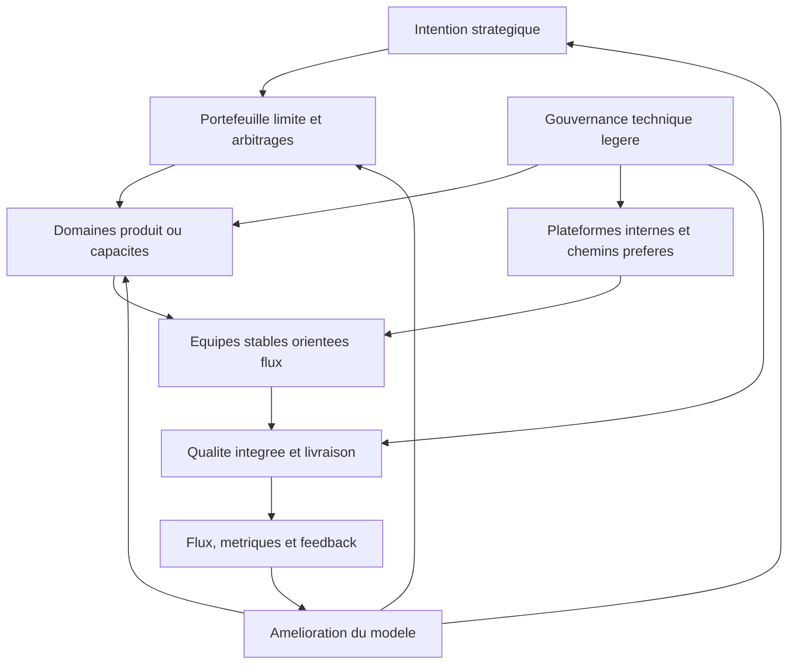

# 7. Organisation cible simplifiee

## Question de recherche

Quelle architecture organisationnelle pragmatique et legere peut coordonner plusieurs centaines de developpeurs tout en preservant autonomie, alignement, visibilite, qualite et capacite d'adaptation ?

## Intention du chapitre

Le chapitre 6 a reconstruit les mecanismes necessaires a partir des problemes fondamentaux. Ce chapitre les assemble en un modele cible.

Le modele propose n'est pas un framework. Il ne definit pas une marque, une certification, un vocabulaire obligatoire ou une structure universelle. Il decrit une architecture organisationnelle minimale : les niveaux de decision, les responsabilites, les cadences, les artefacts et les boucles d'apprentissage necessaires pour faire fonctionner une grande organisation logicielle sans surcharger les equipes.

L'objectif est double :

- conserver les mecanismes indispensables a l'echelle ;
- retirer, fusionner ou simplifier les formes qui n'ajoutent pas de decision, de feedback ou de reduction de risque.

## 7.1 Principes de design

Le modele cible repose sur huit principes.

| Principe | Implication organisationnelle |
|---|---|
| Autonomie avec frontieres | Les equipes decident localement dans un perimetre explicite. |
| Alignement sans micro-pilotage | La strategie fixe des objectifs et contraintes, pas le detail du travail. |
| Reduction des dependances | L'architecture, les plateformes et les frontieres d'equipes sont des leviers prioritaires. |
| Portefeuille limite | L'organisation choisit explicitement ce qu'elle ne fait pas maintenant. |
| Coordination proportionnee | Les synchronisations existent seulement lorsque le cout de non-coordination est superieur. |
| Qualite integree | Les controles sont deplaces le plus tot possible dans le flux. |
| Visibilite systemique | Les metriques servent a diagnostiquer le systeme, pas a classer les equipes. |
| Amelioration du modele | Le modele cible reste revisable, mesurable et simplifiable. |

Ces principes doivent etre traites comme des contraintes de conception. Si une pratique ne sert aucun de ces principes, elle doit etre questionnee.

## 7.2 Vue d'ensemble du modele

Le modele cible peut etre represente comme un systeme de decision et de feedback.

Cette vue montre une logique importante : la strategie ne pilote pas directement les taches des equipes. Elle oriente le portefeuille. Le portefeuille limite les engagements. Les domaines traduisent les objectifs en priorites coherentes. Les equipes livrent dans des frontieres explicites. Les plateformes et la gouvernance technique reduisent les couts de coordination. Les metriques et feedbacks alimentent l'amelioration.

## 7.3 Niveau 1 : intention strategique

### Responsabilite

Le niveau strategique clarifie pourquoi l'organisation investit et quels resultats comptent. Il ne doit pas devenir un mecanisme de pilotage detaille.

Il porte :

- les objectifs business, utilisateurs, operationnels et technologiques majeurs ;
- les contraintes non negociables ;
- les paris strategiques ;
- les priorites relatives ;
- les horizons de decision ;
- les criteres d'arbitrage.

### Artefacts minimaux

Les artefacts doivent etre peu nombreux :

- une intention strategique annuelle ou semestrielle ;
- quelques objectifs mesurables par horizon ;
- une explicitation des contraintes majeures ;
- des principes d'allocation de capacite ;
- une liste courte des sujets non prioritaires.

La liste des sujets non prioritaires est essentielle. Une strategie qui ne dit jamais non n'est pas un mecanisme d'alignement.

### Cadence

Une revue strategique trimestrielle ou semestrielle suffit souvent. Les ajustements peuvent etre plus frequents si le contexte change rapidement, mais l'organisation doit eviter de transformer chaque variation de priorite en replanification massive.

### Anti-patterns

- objectifs trop nombreux ;
- priorites toutes declarees critiques ;
- strategie exprimee uniquement en projets ;
- absence de capacite reservee aux investissements techniques ;
- changements frequents sans retrait explicite de travaux.

## 7.4 Niveau 2 : portefeuille limite

### Responsabilite

Le portefeuille transforme l'intention strategique en engagements explicites. Il decide quels travaux sont finances, lances, arretes, reportes ou explores.

Sa responsabilite centrale est la limitation du WIP organisationnel.

### Perimetre

Le portefeuille doit inclure :

- initiatives produit ;
- investissements plateforme ;
- reduction de dette technique ;
- securite et conformite ;
- fiabilite et operations ;
- experimentation IA ;
- capacite de support et maintenance ;
- initiatives de reduction de dependances.

Si ces categories ne sont pas visibles ensemble, les arbitrages deviennent implicites. Les travaux techniques et operationnels sont alors souvent sacrifies par les initiatives les plus visibles.

### Artefacts minimaux

Un portefeuille cible peut tenir dans un tableau simple :

| Champ | Intention |
|---|---|
| Initiative | Nom comprehensible du travail engage |
| Resultat vise | Effet attendu, pas seulement livrable |
| Domaine responsable | Ownership principal |
| Capacite estimee | Ordre de grandeur de l'effort |
| Dependances | Equipes, plateformes ou decisions requises |
| Etat | Option, cadrage, engage, en livraison, arrete |
| Decision suivante | Continuer, reduire, arreter, pivoter |

L'artefact doit aider a arbitrer, pas a produire un reporting decoratif.

### Cadence

Une revue mensuelle du portefeuille est souvent suffisante pour ajuster les engagements, avec une revue plus profonde par horizon de planification.

### Regles minimales

- aucune initiative majeure sans capacite explicite ;
- aucune nouvelle initiative engagee sans verifier le WIP ;
- aucun travail transversal sans domaine ou proprietaire clair ;
- revue periodique des initiatives qui ne progressent pas ;
- droit explicite d'arreter.

### Anti-patterns

- portefeuille utilise comme inventaire de toutes les demandes ;
- financement par projet qui detruit la stabilite des equipes ;
- arbitrages hors portefeuille par urgence ou influence ;
- absence de capacite pour la dette, la plateforme et la securite ;
- metriques de statut remplaçant les decisions.

## 7.5 Niveau 3 : domaines produit ou capacites

### Responsabilite

Les domaines sont des unites de coordination intermediaires. Ils regroupent plusieurs equipes autour d'un produit, d'une capacite metier, d'une plateforme ou d'un ensemble coherent de services.

Leur role est de traduire les objectifs de portefeuille en priorites executables, de gerer les dependances locales et de maintenir une vision de domaine.

### Taille indicative

Un domaine doit etre assez grand pour porter un resultat significatif, mais assez petit pour rester comprehensible. Une taille indicative peut etre de 4 a 10 equipes. Ce chiffre n'est pas une regle ; il depend du couplage, du domaine fonctionnel, de la maturite technique et de la charge cognitive.

Un domaine trop grand reproduit les problemes du portefeuille. Un domaine trop petit ne reduit pas assez les dependances.

### Responsabilites minimales

Chaque domaine devrait maintenir :

- une vision de domaine ;
- une priorisation locale alignee sur le portefeuille ;
- une carte des dependances ;
- une strategie d'architecture locale ;
- des objectifs de qualite et de flux ;
- une boucle d'amelioration ;
- une relation explicite avec les plateformes et domaines voisins.

### Roles possibles

Le modele cible ne requiert pas de titres uniformes. Il requiert des responsabilites claires :

- responsabilite produit ou metier du domaine ;
- responsabilite technique ou architecture du domaine ;
- responsabilite de coordination du flux et des dependances ;
- responsabilite operationnelle ou fiabilite lorsque le domaine exploite des services critiques.

Ces responsabilites peuvent etre portees par des roles dedies, partages ou combines selon la taille et le contexte. L'important est d'eviter les zones sans proprietaire.

### Cadence

Le domaine peut avoir :

- une revue de priorisation toutes les deux a quatre semaines ;
- une synchronisation de dependances hebdomadaire ou bihebdomadaire si le couplage le justifie ;
- une revue de flux mensuelle ;
- une revue d'architecture et de dependances par horizon.

Ces cadences doivent etre ajustees selon le cout reel de coordination.

## 7.6 Niveau 4 : equipes stables

### Responsabilite

Les equipes sont l'unite principale de livraison et d'apprentissage. Elles doivent posseder un perimetre durable et etre responsables de la qualite de ce qu'elles livrent.

Une equipe cible devrait pouvoir :

- comprendre son utilisateur ou client interne ;
- prioriser son travail dans les contraintes du domaine ;
- livrer frequemment ;
- exploiter ou supporter ce qu'elle possede ;
- ameliorer son systeme de travail ;
- faire evoluer son perimetre technique ;
- escalader les conflits de priorite ou de dependance.

### Composition

La composition depend du contexte, mais l'equipe doit disposer des competences necessaires pour livrer un increment utile sans handovers excessifs. Cela peut inclure developpement, test, produit, UX, data, securite ou operations selon le domaine.

Une equipe n'a pas besoin de tout internaliser. Elle doit cependant avoir acces rapidement aux competences critiques, soit en propre, soit par plateforme, soit par collaboration explicite.

### Droits de decision

Les droits de decision doivent etre explicites :

| Decision | Niveau par defaut |
|---|---|
| Implementation locale | Equipe |
| Priorisation fine du backlog | Equipe avec domaine |
| Choix technique local dans standards | Equipe |
| Changement d'interface publique | Equipe avec parties impactees |
| Changement d'architecture transverse | Domaine ou gouvernance technique |
| Arbitrage de capacite majeur | Portefeuille |

Cette clarification evite que chaque decision soit soit centralisee, soit negociee informellement.

### Anti-patterns

- equipes stables seulement de nom, mais recomposees par projet ;
- equipe responsable d'un perimetre qu'elle ne peut pas modifier ;
- autonomie sans priorites explicites ;
- ownership sans responsabilite operationnelle ;
- dependances permanentes normalisees comme inevitables.

## 7.7 Plateformes internes

### Responsabilite

Les plateformes internes fournissent des capacites communes qui reduisent la charge cognitive et le cout de livraison des equipes.

Elles doivent etre concues comme des produits internes, pas comme des fonctions de controle.

### Capacites prioritaires

Le socle minimal peut inclure :

- templates de services ou applications ;
- pipelines standardises ;
- deploiement automatise ;
- observabilite ;
- gestion des secrets ;
- controles de securite integres ;
- environnements de developpement et test ;
- documentation self-service ;
- support et accompagnement.

Le choix des capacites doit etre guide par les frictions reelles des equipes.

### Mode de fonctionnement

Une plateforme cible devrait avoir :

- une roadmap ;
- des utilisateurs identifies ;
- un canal de feedback ;
- des indicateurs d'adoption et satisfaction ;
- des objectifs de fiabilite ;
- une politique d'exception ;
- une documentation maintenue.

### Indicateurs utiles

- temps pour creer un nouveau service ;
- temps pour deployer ;
- taux d'adoption des chemins preferes ;
- satisfaction developpeur ;
- nombre de tickets de support repetitifs ;
- incidents lies a la plateforme ;
- capacite equipe economisee ou reallouee.

### Anti-patterns

- plateforme imposee sans experience utilisateur ;
- plateforme qui centralise toutes les demandes ;
- standard sans chemin concret pour l'appliquer ;
- equipe plateforme mesuree uniquement par volume de fonctionnalites ;
- absence de priorisation entre besoins internes.

## 7.8 Gouvernance technique et architecture

### Responsabilite

La gouvernance technique protege les proprietes systemiques du logiciel. Elle doit etre assez forte pour eviter la fragmentation, mais assez legere pour ne pas ralentir les decisions locales.

Elle couvre :

- principes d'architecture ;
- choix technologiques communs ;
- securite ;
- donnees ;
- fiabilite ;
- observabilite ;
- cout d'exploitation ;
- interopérabilite ;
- reduction des dependances.

### Forme cible

La forme cible combine trois niveaux :

| Niveau | Fonction |
|---|---|
| Standards minimaux | Ce que toutes les equipes doivent respecter |
| Chemins preferes | Solutions recommandees et supportees |
| Revue proportionnee | Discussion des decisions a risque systemique |

Cette combinaison permet d'eviter deux extremes : laisser chaque equipe tout choisir ou tout soumettre a approbation.

### Architecture decision records

Les decisions importantes doivent etre documentees legerement. Un ADR doit expliquer :

- le contexte ;
- la decision ;
- les options considerees ;
- les consequences ;
- les equipes impactees ;
- les criteres de revision.

L'objectif n'est pas de documenter pour auditer. L'objectif est de conserver la memoire des compromis.

### Cadence

Une communaute ou revue d'architecture peut se reunir regulierement, mais son agenda doit etre tire par les decisions a prendre et les risques a traiter. Si elle devient une revue passive de slides, elle doit etre simplifiee.

### Anti-patterns

- architecture comme autorite de validation tardive ;
- standards trop nombreux ;
- exceptions non tracees ;
- decisions centrales prises sans connaissance du terrain ;
- architecture separee du portefeuille et des plateformes.

## 7.9 Coordination et cadences

Le modele cible doit definir les cadences minimales utiles. Une cadence n'est justifiee que si elle produit une decision, un alignement, un feedback ou une reduction de risque.

| Cadence | Participants | Sorties attendues |
|---|---|---|
| Revue strategique | Direction produit, technologie, operations, finance | Priorites et contraintes ajustees |
| Revue portefeuille | Responsables portefeuille et domaines | WIP, arbitrages, arrets, lancements |
| Planification par domaine | Equipes du domaine et parties dependantes | Objectifs, dependances, risques |
| Synchronisation inter-domaines | Domaines dependants | Decisions sur dependances critiques |
| Revue de flux | Domaines, equipes, plateforme | Goulets, delais, rework, actions |
| Revue architecture | Leaders techniques et equipes concernees | Decisions et standards ajustes |
| Revue du modele operatoire | Leadership et representants terrain | Simplifications et evolutions du systeme |

Le modele cible doit preferer des cadences moins nombreuses mais plus decisives. Une reunion sans sortie explicite doit etre modifiee ou supprimee.

## 7.10 Artefacts minimaux

Le systeme peut fonctionner avec un petit nombre d'artefacts.

| Artefact | Usage |
|---|---|
| Intention strategique | Clarifier direction et contraintes |
| Tableau de portefeuille | Limiter WIP et arbitrer |
| Carte des domaines | Comprendre le decoupage |
| Carte d'ownership | Savoir qui decide et supporte |
| Carte des dependances | Anticiper les coordinations necessaires |
| Standards techniques minimaux | Proteger les proprietes systemiques |
| Catalogue plateforme | Rendre les capacites self-service visibles |
| Tableau de flux | Diagnostiquer le systeme |
| Journal de decisions | Garder la memoire des compromis |

Ces artefacts doivent etre maintenus parce qu'ils servent, non parce qu'ils sont exiges. Un artefact non utilise doit etre retire ou repense.

## 7.11 Metriques de pilotage

Les metriques cible doivent couvrir quatre dimensions.

### Flux

- lead time ;
- throughput ;
- WIP ;
- age du travail en cours ;
- temps d'attente ;
- dependances bloquees.

### Stabilite et qualite

- frequence de deploiement ;
- taux d'echec de changement ;
- temps de restauration ;
- incidents ;
- rework ;
- couverture des controles critiques.

### Valeur et portefeuille

- objectifs atteints ;
- initiatives arretees ou pivotees ;
- capacite allouee par type de travail ;
- delai de decision ;
- satisfaction utilisateur ou client interne.

### Sante du systeme

- satisfaction developpeur ;
- charge cognitive ;
- adoption plateforme ;
- dette technique visible ;
- nombre de dependances recurrentes ;
- qualite des interfaces.

Le modele doit eviter les metriques de conformite processuelle comme indicateur principal. Le nombre de ceremonies tenues, de story points produits ou de tickets fermes ne suffit pas a prouver une meilleure performance.

## 7.12 Modele de roles

Le modele cible prefere definir des responsabilites plutot que multiplier les titres.

| Responsabilite | Fonction |
|---|---|
| Strategie produit/metier | Definir les resultats et arbitrages business |
| Portefeuille | Limiter le WIP et allouer la capacite |
| Leadership de domaine | Coordonner priorites, dependances et resultats de domaine |
| Product ownership d'equipe | Connecter travail d'equipe et besoins utilisateurs |
| Leadership technique | Maintenir qualite, architecture et decisions techniques |
| Plateforme | Fournir des capacites communes utilisables |
| Facilitation de flux | Rendre visibles blocages, dependances et ameliorations |
| Securite/conformite | Integrer controles et contraintes dans le flux |

Selon le contexte, une personne peut porter plusieurs responsabilites ou une responsabilite peut etre partagee. La question centrale est : "Qui a le mandat et la capacite d'agir ?"

## 7.13 Variantes selon le contexte

Le modele cible doit etre adapte selon trois dimensions.

### Couplage technique

Si le systeme est fortement couple, il faut plus de planification inter-domaines, plus d'architecture transverse et plus d'investissements de decouplage. Si le systeme est modulaire, la coordination peut etre plus legere.

### Regulation et risque

Si le contexte est fortement regule, la tracabilite, les controles, la separation des responsabilites et la preuve d'audit doivent etre plus explicites. La simplification doit alors porter sur l'automatisation des preuves et l'integration des controles, pas sur leur suppression.

### Maturite technique

Si CI/CD, tests, observabilite et plateformes sont faibles, l'organisation aura besoin temporairement de plus de coordination manuelle. Mais cette coordination doit etre traitee comme une dette a reduire, pas comme un etat cible.

## 7.14 Trajectoire de transition

Une organisation ne passe pas directement d'un modele lourd a un modele cible. La transition doit etre progressive.

### Etape 1 : cartographier

Identifier :

- les domaines reels ;
- les equipes et ownerships ;
- les dependances recurrentes ;
- les cadences existantes ;
- les artefacts et reportings ;
- les goulets de flux ;
- les controles de qualite et securite.

### Etape 2 : distinguer fonction et forme

Pour chaque pratique existante, demander :

- quelle fonction remplit-elle ?
- quel probleme traite-t-elle ?
- qui utilise sa sortie ?
- quel risque apparait si elle disparait ?
- existe-t-il une forme plus legere ?

### Etape 3 : simplifier par mecanisme

Commencer par les zones ou le gain est clair :

- supprimer les reunions sans decision ;
- fusionner les reportings redondants ;
- traduire le vocabulaire proprietaire en termes neutres ;
- clarifier ownership et droits de decision ;
- limiter le WIP portefeuille ;
- renforcer les plateformes et controles automatises.

### Etape 4 : investir dans les contraintes structurelles

La simplification durable vient surtout de :

- decoupage d'architecture ;
- CI/CD ;
- tests ;
- observabilite ;
- plateformes ;
- reduction des dependances ;
- clarification des domaines.

### Etape 5 : installer une revue du modele

Tous les trimestres ou semestres, verifier :

- quelles pratiques ont reduit le cout de coordination ;
- quelles pratiques ajoutent de la charge ;
- quelles dependances doivent etre traitees structurellement ;
- quels roles ou artefacts peuvent etre retires ;
- quels standards doivent etre renforces.

## 7.15 Risques de mise en oeuvre

### Simplification cosmetique

Le premier risque est de renommer les structures sans changer les mecanismes. L'organisation peut abandonner un vocabulaire framework tout en gardant les memes reunions, les memes files d'attente et les memes droits de decision.

### Suppression sans remplacement

Le deuxieme risque est de supprimer des ceremonies ou roles qui traitaient un vrai probleme. Si les dependances ne sont plus visibles, si le portefeuille n'est plus limite ou si les decisions techniques ne sont plus gouvernees, la simplification augmente le risque.

### Autonomie fictive

Le troisieme risque est de declarer les equipes autonomes sans leur donner de frontieres, capacite, droits de decision ou soutien plateforme. L'autonomie devient alors une responsabilite sans levier.

### Centralisation par reflexe

Le quatrieme risque est de recentraliser des decisions des qu'un probleme apparait. Certains problemes exigent une coordination transverse, mais beaucoup exigent une meilleure interface, un standard plus clair ou une capacite plateforme.

### Metriques mal utilisees

Le cinquieme risque est d'utiliser les metriques pour comparer ou sanctionner les equipes. Le systeme perd alors la qualite de l'information dont il a besoin pour s'ameliorer.

## 7.16 Definition d'un modele cible viable

Un modele cible viable doit satisfaire dix criteres.

| Critere | Question de verification |
|---|---|
| Priorites explicites | Savons-nous ce qui compte le plus maintenant ? |
| WIP limite | Savons-nous ce que nous refusons ou retardons ? |
| Ownership clair | Savons-nous qui decide et qui supporte ? |
| Dependances visibles | Savons-nous ou les equipes s'attendent ? |
| Coordination proportionnee | Les reunions produisent-elles des decisions ? |
| Qualite integree | Decouvrons-nous les problemes assez tot ? |
| Plateforme utile | Les equipes gagnent-elles du temps grace aux capacites communes ? |
| Architecture evolutive | Reduisons-nous les dependances structurelles ? |
| Metriques de diagnostic | Voyons-nous le flux reel et ses goulets ? |
| Apprentissage organisationnel | Retirons-nous les pratiques devenues inutiles ? |

Si ces criteres sont satisfaits, le nom du modele importe peu. S'ils ne le sont pas, aucun vocabulaire ne compensera les lacunes.

## 7.17 Synthese

L'organisation cible simplifiee est une architecture de responsabilites, de decisions et de feedbacks.

Elle conserve :

- une intention strategique explicite ;
- un portefeuille limite ;
- des domaines coherents ;
- des equipes stables ;
- des plateformes internes ;
- une gouvernance technique legere ;
- des cadences proportionnees ;
- des artefacts minimaux ;
- des metriques de diagnostic ;
- une boucle d'amelioration du modele.

Elle retire ou reduit :

- le vocabulaire inutile ;
- les ceremonies sans decision ;
- les roles sans mandat ;
- le reporting redondant ;
- la planification trop detaillee ;
- la coordination qui compense indefiniment un mauvais decoupage.

Le point central est que la simplification n'est pas une reduction uniforme. Certaines structures doivent etre supprimees. D'autres doivent etre renforcees. En particulier, le portefeuille, les frontieres d'ownership, les plateformes, la qualite integree et l'architecture doivent souvent devenir plus solides pour que les ceremonies puissent devenir plus legeres.

Le chapitre final synthetise cette logique et ses implications pour une organisation qui cherche a sortir d'un modele trop lourd sans perdre les mecanismes necessaires a l'echelle.
