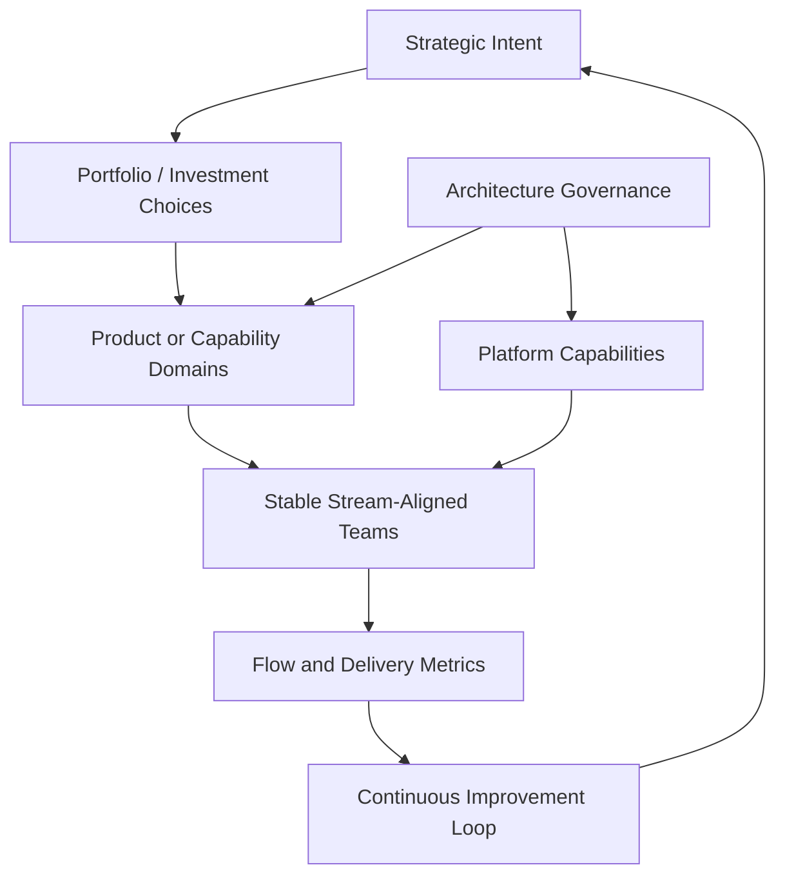

# 7. Target Simplified Organization

## Research question

What pragmatic lightweight organizational architecture would fit a program of several hundred developers while preserving autonomy, coordination, visibility, quality, and adaptability?

## Design goals

- autonomy of teams;
- coordination across dependencies;
- visibility without excessive reporting;
- minimal organizational cost;
- quality and technical sustainability;
- adaptability to changing priorities.

## Candidate architecture

## Mechanism catalogue

Each mechanism should be documented with:

- purpose;
- problem addressed;
- operating model;
- cost;
- risk of removal;
- possible simplification;
- evidence level.

## Expected outcome

A lightweight proposal that is not branded as a framework and can be adapted to the local context.
