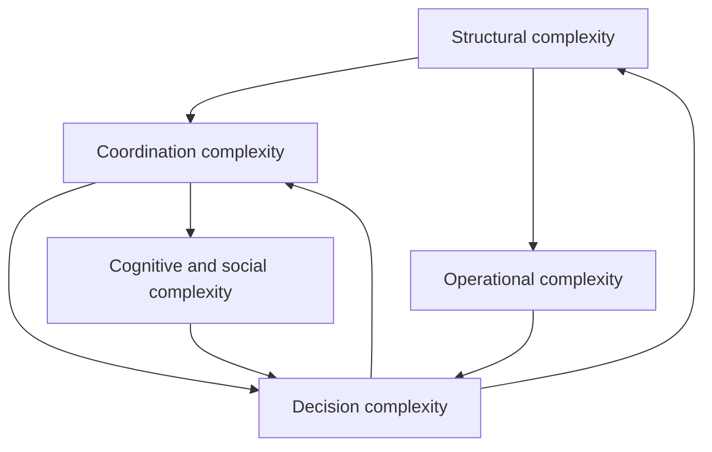

<!-- source-hash: sha256:376f1f0f004089b32e9161422c0ed51f6d1fa74c0d488a84c352bc431fd7a26c -->

# 1. The fundamental problems of large-scale software development

## Research question

What problems naturally arise when a software development organization grows from a few teams to several hundred developers?

## Intent of the chapter

This chapter does not start with frameworks. It does not seek to explain SAFe, LeSS, Nexus, Scrum of Scrums, Team Topologies or Flight Levels. On the contrary, it seeks to identify the structural constraints to which these approaches attempt, each in their own way, to respond.

The initial hypothesis is simple: beyond a certain scale, the major difficulties of a software organization do not come primarily from a lack of method, but from the interaction between technical complexity, organizational complexity, product uncertainty and coordination costs.

An organization can remove a framework. It cannot remove the problems that this framework was trying to address. If these problems remain present, they will reappear in other forms: informal meetings, managerial escalations, ad hoc committees, invisible dependencies, political trade-offs, integration delays, overload of experts, or reporting disconnected from real work.

## 1.1 Why the scale changes the nature of the problem

Scaling up is not just a quantitative increase in the number of people. It is a qualitative change in the nature of the system to be managed.

A team of eight people can often operate with largely implicit coordination. Members share the same context, know the decisions being made, quickly see the effects of their work, and can resolve many problems through direct conversation.

An organization of several hundred developers no longer has this property. Not all people know each other. Teams do not share the same context. Local decisions can have distant effects. Dependencies become difficult to perceive. Priorities compete. Deadlines are no longer only linked to the difficulty of the work, but also to the queues, validations, trade-offs and synchronizations necessary to move it forward.

The central problem therefore becomes less:

> How to increase the individual productivity of developers?

and more:

> How can we design an organizational system that allows hundreds of people to produce value coherently, without the cost of coordination consuming an excessive part of their capacity?

This distinction is fundamental. Many transformations fail because they attempt to improve teams without changing the systemic conditions in which those teams operate.

## 1.2 Three structural forces

Three forces explain the emergence of fundamental problems on a large scale.

### 1.2.1 The growth of interactions

The number of potential relationships between people, teams, components, and decisions grows faster than the number of actors. Not all of these relationships are permanently active, but the organization must nevertheless manage a much broader space of interactions.

Frederick Brooks popularized this intuition in *The Mythical Man-Month*: adding people to a software project does not mechanically increase the usable capacity, because the costs of communication, training and integration also increase. His thesis is not that all team growth is impossible, but that software work is not perfectly divisible into independent units.

On a large scale, this property manifests itself between teams. The more work is coupled, the more teams must exchange, negotiate, synchronize and wait. The cost is therefore not just the time spent in meetings; it is also the delay introduced by uncertainty, waiting, resuming work and late resolution of inconsistencies.

### 1.2.2 Technical and organizational coupling

Software development is constrained by the architecture of the product system. When two teams modify highly coupled parts of the same system, they cannot be truly autonomous. They must coordinate interfaces, data models, API contracts, testing, migrations, releases and sometimes product decisions.

Conway's Law, from Melvin Conway's 1968 article, expresses the idea that there is a strong correspondence between the communication structures of an organization and the systems it designs. This observation is often simplified, but it remains essential: organization and architecture are not independent.

Two consequences arise from this.

First, some difficulties attributed to the working method are actually symptoms of architectural coupling. An organization can add coordination rituals, but if the architecture imposes permanent dependencies, these rituals will only manage the problem without reducing it.

Second, architecture can be used as an organizational lever. Modularity, stable interfaces, internal platforms, clear ownership and division by domain can reduce the need for human coordination.

### 1.2.3 Uncertainty and variability

Software is an activity of design and discovery. Needs evolve, technical constraints are sometimes discovered late, product hypotheses can be invalidated and external dependencies are not always controlled.

This uncertainty makes detailed long-term planning fragile. On a small scale, deviations can be absorbed by local adjustment. At scale, local variability propagates: a delay in a platform, an API, a regulatory validation or an architectural decision can affect dozens of teams.

The upshot is that large organizations need both alignment and adaptation. Too little planning creates chaos. Too much planning creates an illusion of control and increases the cost of change.

## 1.3 Taxonomy of fundamental problems

Large-scale software development problems can be grouped into five families. These families are distinct for analysis, but strongly interdependent in reality.

This mapping highlights an important point: there is no such thing as an isolated problem. A prioritization decision can create dependencies. A coupled architecture can generate meetings. Poor visibility can lead to heavier governance. Overly burdensome governance can slow feedback and increase uncertainty.

## 1.4 Structural complexity

Structural complexity refers to the intrinsic complexity of the software system and shared technical assets.

It includes:

- architecture;
- coupling between components;
- shared data models;
- common platforms;
- integration environments;
- infrastructure dependencies;
- security, compliance and operational constraints.

### Why it appears

As a software system evolves, it accumulates features, exceptions, interfaces, historical constraints, and technical choices that are difficult to question. Large organizations rarely work on a new system. They operate on existing application landscapes, often composed of successive technical generations.

Structural complexity becomes critical when teams can no longer modify part of the system without coordination with several other teams. The symptom is not just the complexity of the code, but the increase in the impact radius of a local decision.

### Consequences if left unaddressed

Uncontrolled structural complexity produces several effects:

- slowing down of change;
- multiplication of dependencies;
- difficulty in testing;
- increased risk of incidents;
- growing need for human coordination;
- concentration of knowledge among a few experts;
- difficulty in clearly assigning ownership.

The danger is that the organization often tries to compensate for this complexity with more processes. However, if the problem is architectural, the organizational response can only be a palliative.

### Tensions created

Structural complexity creates a tension between autonomy and coherence. Giving autonomy to teams working on a tightly coupled system can speed up decisions locally, but increase integration conflicts overall. Conversely, centralizing all architectural decisions protects consistency, but slows down teams and overloads experts.

The sustainable compromise generally consists of combining clearer technical boundaries, minimum standards and lightweight architecture governance.

## 1.5 Coordination complexity

Coordination complexity arises when multiple teams must contribute to common outcomes while sharing technical, functional, or operational dependencies.

It includes:

- coordination of dependencies;
- synchronization of deliveries;
- management of inter-team trade-offs;
- resolving blockages;
- planning of cross-functional work;
- coordination between product, architecture, security, operation and development.

### Why it appears

On a small scale, coordination is often done through proximity. On a large scale, proximity disappears. Teams must then have explicit mechanisms to make their dependencies, intentions and constraints visible.

Coordination becomes critical when the success of one team regularly depends on the work of other teams. In this case, performance can no longer be understood team by team: it becomes a property of the network of dependencies.

### Consequences if left unaddressed

Insufficient coordination produces:

- late surprises;
- integration delays;
- priority conflicts;
- blocked teams;
- work redone;
- repeated managerial escalations;
- a loss of confidence in planning.

The typical symptom is the organization that seems very busy but delivers little integrated value.

### Tensions created

Coordination is necessary, but costly. Each meeting, role, committee or artifact must therefore be justified by an avoided cost greater than its own cost.

A mature organization does not seek to maximize coordination. It seeks to minimize the need for coordination and then make the remaining coordination explicit.

This distinction is central to simplification: removing ceremonies without reducing dependencies often amounts to making problems invisible rather than solving them.

## 1.6 Decision complexity

Decision complexity concerns how a large organization chooses what should be done, in what order, with what resources and under what constraints.

It includes:

- strategic alignment;
- prioritization;
- arbitration between initiatives;
- budgetary governance;
- risk management;
- the resolution of conflicts between local objectives and global objectives.

### Why it appears

Available capacity is always lower than demand. As the organization grows, the number of stakeholders, products, regulatory constraints, customer needs and internal initiatives increases.

Without an explicit decision mechanism, prioritization becomes implicit. It then moves towards the most influential actors, the most visible emergencies or the teams most capable of defending their agenda.

### Consequences if left unaddressed

Uncontrolled decision-making complexity produces:

- too many simultaneous initiatives;
- a dilution of capacity;
- organizational multitasking;
- frequent priority changes;
- difficulty saying no;
- poor strategic clarity for teams;
- a loss of trust between management and execution.

The problem is not just the lack of strategy. There is often a lack of operational translation of the strategy into explicit choices.

### Tensions created

Decision complexity creates a tension between autonomy and alignment. Local autonomy is valuable, but it must be exercised within a framework that makes trade-offs understandable.

A large organization therefore needs a strategic alignment mechanism. This mechanism can take several forms: quarterly objectives, investment portfolio, priority reviews, periodic planning, OKRs, or other. The name matters less than the function: make choices explicit and debatable.

## 1.7 Operational complexity

Operational complexity concerns the ability to integrate, test, deliver, operate and maintain a large-scale software system.

It includes:

- continuous integration;
- validation;
- quality;
- security;
- deployment;
- observability;
- incident management;
- operational resilience.

### Why it appears

When dozens of teams modify a system simultaneously, integration becomes a central issue. Each change may be correct locally but create a global problem.

Historically, many organizations have attempted to solve this problem with late integration phases, code freezes, release trains, or massive commit cycles. These mechanisms may be necessary in certain contexts, but they come at a high cost: they delay feedback.

DORA research and related work at *Accelerate* has greatly popularized the idea that successful organizations combine speed and stability through technical practices such as continuous integration, automated testing, frequent deployment, observability, and the ability to quickly restore service.

### Consequences if left unaddressed

Uncontrolled operational complexity produces:

- defects detected late;
- long release cycles;
- a fear of deployment;
- unstable environments;
- excessive separation between development and operation;
- a validation debt;
- a progressive reduction in the capacity to change.

Quality then becomes a systemic property. It can no longer be guaranteed by an isolated team nor by a final testing phase.

### Tensions created

Operational complexity creates a tension between apparent speed and real speed. A team can produce code quickly, but if that code waits a long time to be integrated, validated, or deployed, the overall system remains slow.

The key point is that technical practices can replace part of the organizational mechanisms. The more integration, testing, and deployments are automated, the less the organization needs to manually coordinate releases.

## 1.8 Cognitive and social complexity

Cognitive and social complexity concerns the distribution of knowledge, trust, responsibilities, team identities and collective behaviors.

It includes:

- the cognitive load of the teams;
- tacit knowledge;
- communities of practice;
- inter-team trust;
- ownership;
- gray areas of responsibility;
- local optimization behaviors.

### Why it appears

No single person can understand the entire system developed by several hundred people. Knowledge becomes distributed. Some information is documented, but much remains tacit: history of decisions, reasons for trade-offs, actual system behavior, informal dependencies.

On a large scale, the organization must therefore decide where to place knowledge, how to maintain it and how to enable teams to make good decisions without knowing everything.

### Consequences if left unaddressed

Uncontrolled cognitive and social complexity produces:

- overload of experts;
- slow decisions;
- dependence on a few key people;
- duplication of efforts;
- loss of collective learning;
- ownership conflicts;
- low capacity for innovation.

Teams can become locally effective but globally misaligned. They optimize their own objectives, their own metrics or their own backlog, sometimes to the detriment of the overall value flow.

### Tensions created

This complexity creates a tension between specialization and global understanding. The more specialized the teams, the more effective they can be locally. But the more specialized they are, the more the organization must invest in interfaces, documentation, communities and cross-team learning mechanisms.

## 1.9 The major systemic trade-offs

The previous problems cannot be resolved independently. Any solution introduces trade-offs.

| Voltage | Risk of an extreme | Risk of the other extreme |
|---|---|---|
| Autonomy vs. alignment | fragmentation, inconsistency | bureaucracy, slowness |
| Speed ​​vs. Quality | debt, incidents | overcontrol, delay |
| Standardization vs. local adaptation | rigidity | unmanageable heterogeneity |
| Centralization vs local decision | bottlenecks | local optimization |
| Predictability vs learning | illusion of control | permanent unpredictability |
| Coordination vs Simplicity | organizational overload | invisible dependencies |

This table underlines an essential point: there is no organizational design without cost. The right question is therefore not:

> How to remove coordination?

but :

> What is the minimum level of explicit coordination necessary given the coupling, uncertainty and risks of the context?

## 1.10 Emergence thresholds and weak signals

It would be artificial to define a universal threshold at which each problem becomes critical. Thresholds depend on architectural coupling, technical maturity, geographic distribution, business domain and regulatory constraints.

However, certain signals indicate that an organization has entered a zone of systemic complexity:

- teams spend more time waiting than developing;
- the dependencies are discovered late;
- priorities change faster than the capacity to deliver;
- the same experts are called upon on all critical subjects;
- releases require exceptional coordination;
- the reporting indicators are contested by the teams;
- decisions are regularly escalated;
- incidents reveal unclear responsibilities;
- technical debt becomes a subject of governance rather than a local subject.

These signals are important because they help distinguish a merely large organization from one that has become structurally complex.

## 1.11 Implication for the rest of the paper

This analysis leads to a structuring conclusion for the entire paper.

Scaling frameworks should not be evaluated primarily as sets of practices, but as answers to five families of problems:

1. structural complexity;
2. coordination complexity;
3. decision complexity;
4. operational complexity;
5. cognitive and social complexity.

An organizational mechanism is only valuable if it reduces one of these problems more than it adds cost.

Thus, simplifying an organization historically structured by a framework should not consist of removing the visible elements of the framework. It should consist of asking, for each existing mechanism, four questions:

1. What problem does this mechanism address?
2. Does this problem still exist in our context?
3. Is there an easier way to deal with it?
4. What would happen if we removed this mechanism without an alternative?

This logic makes it possible to avoid two symmetrical errors: retaining ceremonies through inertia, or removing essential mechanisms through cultural rejection of the framework.

## 1.12 Summary

On a large scale, the fundamental problems of software development are not primarily methodological. They are systemic.

They appear because:

- the number of interactions increases;
- technical coupling creates organizational coupling;
- uncertainty spreads between teams;
- local decisions have global effects;
- quality becomes an integrated property of the system;
- knowledge becomes distributed;
- coordination capacity itself becomes a rare resource.

The rest of the paper will use this taxonomy as a basis. Universal principles will be analyzed as answers to these problems. The frameworks will then be studied as partial implementations of these principles, and not as starting points.

## Initial sources to explore further

- Brooks, Frederick P. *The Mythical Man-Month: Essays on Software Engineering*. Addison-Wesley, 1975.
- Conway, Melvin E. "How Do Committees Invent?" *Datamation*, 1968.
- Parnas, David L. "On the Criteria To Be Used in Decomposing Systems into Modules." *Communications of the ACM*, 1972.
- Reinertsen, Donald G. *The Principles of Product Development Flow*. Celeritas, 2009.
- Forsgren, Nicole; Humble, Jez; Kim, Gene. *Accelerate: The Science of Lean Software and DevOps*. ITRevolution, 2018.
-DORA. *Accelerate State of DevOps Reports*. Google Cloud / DORA research program.
- Skelton, Matthew; Pais, Manuel. *Team Topologies*. ITRevolution, 2019.
- Mintzberg, Henry. *Structure in Fives*. Prentice-Hall, 1983.
