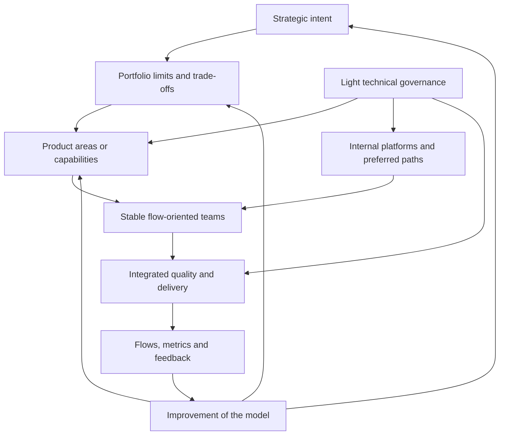

<!-- source-hash: sha256:7ec96041f358999740caf5fa25675ace7192a540980bebbc486f448bd1479451 -->

# 7. Simplified target organization

## Research question

What pragmatic and lightweight organizational architecture can coordinate several hundred developers while preserving autonomy, alignment, visibility, quality and ability to adapt?

## Intent of the chapter

Chapter 6 reconstructed the necessary mechanisms from the fundamental problems. This chapter assembles them into a target model.

The proposed model is not a framework. It does not define a brand, a certification, a mandatory vocabulary or a universal structure. It describes a minimal organizational architecture: the decision levels, responsibilities, cadences, artifacts, and learning loops needed to run a large software organization without overburdening teams.

The objective is twofold:

- maintain the essential mechanisms at scale;
- remove, merge or simplify forms that do not add decision, feedback or risk reduction.

## 7.1 Design principles

The target model is based on eight principles.

| Principle | Organizational involvement |
|---|---|
| Autonomy with boundaries | Teams decide locally within an explicit scope. |
| Alignment without micro-control | The strategy sets objectives and constraints, not the details of the work. |
| Dependency Reduction | Architecture, platforms and team boundaries are priority levers. |
| Limit the portfolio | The organization is explicitly choosing what it is not doing now. |
| Proportionate coordination | Synchronizations only exist when the cost of non-coordination is higher. |
| Integrated quality | Controls are moved as early as possible in the flow. |
| Systemic visibility | Metrics are used to diagnose the system, not to rank teams. |
| Model improvement | The target model remains revisable, measurable and simplifiable. |

These principles should be treated as design constraints. If a practice does not serve any of these principles, it must be questioned.

## 7.2 Model overview

The target model can be represented as a decision and feedback system.

This view shows an important logic: the strategy does not directly control the tasks of the teams. It guides the portfolio. The portfolio limits commitments. Domains translate objectives into coherent priorities. Teams deliver within explicit boundaries. Platforms and technical governance reduce coordination costs. Metrics and feedback fuel improvement.

## 7.3 Level 1: strategic intention

### Responsibility

The strategic level clarifies why the organization is investing and what results matter. It should not become a detailed steering mechanism.

He wears:

- major business, user, operational and technological objectives;
- non-negotiable constraints;
- strategic bets;
- relative priorities;
- decision horizons;
- the prioritization criteria.

### Minimal artifacts

The artifacts must be few in number:

- an annual or half-yearly strategic intention;
- some measurable objectives by horizon;
- an explanation of the major constraints;
- capacity allocation principles;
- a short list of non-priority subjects.

The list of non-priority topics is essential. A strategy that never says no is not an alignment mechanism.

### Cadence

A quarterly or half-yearly strategic review is often sufficient. Adjustments may be more frequent if the context changes quickly, but the organization must avoid turning each change in priority into massive replanning.

### Anti-patterns

- too many objectives;
- priorities all declared critical;
- strategy expressed only in projects;
- absence of capacity reserved for technical investments;
- frequent changes without explicit removal of work.

## 7.4 Level 2: limit the portfolio

### Responsibility

The portfolio transforms strategic intent into explicit commitments. He decides which works are financed, launched, stopped, postponed or explored.

Its central responsibility is the limitation of organizational WIP.

### Perimeter

The portfolio must include:

- product initiatives;
- platform investments;
- reduction of technical debt;
- security and compliance;
- reliability and operations;
- AI experimentation;
- support and maintenance capacity;
- dependency reduction initiatives.

If these categories are not visible together, the trade-offs become implicit. Technical and operational work is then often sacrificed by the most visible initiatives.

### Minimal artifacts

A target portfolio can fit into a simple table:

| Field | Intent |
|---|---|
| Initiative | Comprehensible name of the work engaged |
| Target result | Expected effect, not just deliverable |
| Responsible domain | Primary ownership |
| Estimated capacity | Order of magnitude of the effort |
| Dependencies | Required teams, platforms or decisions |
| State | Option, framing, commit, in delivery, stop |
| Next decision | Continue, collapse, stop, pivot |

The artifact should help arbitrate, not produce decorative reporting.

### Cadence

A monthly portfolio review is often sufficient to adjust commitments, with a more in-depth review by planning horizon.

### Minimum rules

- no major initiative without explicit capacity;
- no new initiatives undertaken without checking the WIP;
- no cross-functional work without a clear domain or owner;
- periodic review of initiatives that are not progressing;
- explicit right to arrest.

### Anti-patterns

- portfolio used as an inventory of all requests;
- project financing which destroys the stability of teams;
- non-portfolio prioritizations due to urgency or influence;
- lack of capacity for debt, platform and security;
- status metrics replacing decisions.

## 7.5 Level 3: product areas or capabilities

### Responsibility

Domains are intermediate coordination units. They bring together several teams around a product, a business capability, a platform or a coherent set of services.

Their role is to translate portfolio objectives into executable priorities, manage local dependencies, and maintain domain vision.

### Indicative size

A domain must be large enough to yield a meaningful result, but small enough to remain understandable. An indicative size can be from 4 to 10 teams. This figure is not a rule; it depends on the coupling, the functional domain, technical maturity and cognitive load.

Too large a domain reproduces portfolio problems. A domain that is too small does not reduce dependencies enough.

### Minimum responsibilities

Each domain should maintain:

- a domain vision;
- local prioritization aligned with the portfolio;
- a map of outbuildings;
- a local architectural strategy;
- quality and flow objectives;
- an improvement loop;
- an explicit relationship with neighboring platforms and domains.

### Possible roles

The target model does not require uniform titles. It requires clear responsibilities:

- product or professional responsibility in the field;
- technical responsibility or architecture of the domain;
- responsibility for coordinating flow and dependencies;
- operational responsibility or reliability when the domain operates critical services.

These responsibilities can be carried by dedicated, shared or combined roles depending on size and context. The important thing is to avoid ownerless areas.

### Cadence

The domain can have:

- a prioritization review every two to four weeks;
- weekly or biweekly synchronization of dependencies if the coupling justifies it;
- a monthly flow review;
- a review of architecture and dependencies by horizon.

These rates must be adjusted according to the real cost of coordination.

## 7.6 Level 4: stable teams

### Responsibility

Teams are the primary unit of delivery and learning. They must have a sustainable scope and be responsible for the quality of what they deliver.

A target team should be able to:

- understand your internal user or customer;
- prioritize your work within the constraints of the field;
- deliver frequently;
- exploit or support what it has;
- improve your work system;
- develop its technical scope;
- escalate priority or dependency conflicts.

### Composition

The composition depends on the context, but the team must have the necessary skills to deliver a useful increment without excessive handovers. This may include development, testing, product, UX, data, security or operations depending on the domain.

A team does not need to internalize everything. However, it must have rapid access to critical skills, either on its own, through a platform, or through explicit collaboration.

### Decision rights

Decision rights must be explicit:

| Decision | Default level |
|---|---|
| Local implementation | Team |
| Fine prioritization of the backlog | Team with domain |
| Local technical choice in standards | Team |
| Public interface change | Team with impacted parties |
| Change of transversal architecture | Domain or technical governance |
| Major capacity allocation | Wallet |

This clarification prevents each decision from being either centralized or negotiated informally.

### Anti-patterns

- stable teams only in name, but recomposed by project;
- team responsible for a perimeter that it cannot modify;
- autonomy without explicit priorities;
- ownership without operational responsibility;
- permanent dependencies normalized as inevitable.

## 7.7 Internal platforms

### Responsibility

Internal platforms provide common capabilities that reduce the cognitive load and delivery cost of teams.

They should be designed as internal products, not as control functions.

### Priority Capabilities

The minimum base may include:

- service or application templates;
- standardized pipelines;
- automated deployment;
- observability;
- management of secrets;
- integrated security controls;
- development and test environments;
- self-service documentation;
- support and accompaniment.

The choice of capabilities must be guided by the real frictions of the teams.

### Operating mode

A target platform should have:

- a roadmap;
- identified users;
- a feedback channel;
- adoption and satisfaction indicators;
- reliability objectives;
- an exceptional policy;
- maintained documentation.

### Useful indicators

- time to create a new service;
- time to deploy;
- adoption rate of preferred paths;
- developer satisfaction;
- number of repetitive support tickets;
- incidents linked to the platform;
- team capacity saved or reallocated.

### Anti-patterns

- imposed platform without user experience;
- platform which centralizes all requests;
- standard without concrete path to apply it;
- platform team measured only by volume of features;
- lack of prioritization between internal needs.

## 7.8 Technical governance and architecture

### Responsibility

Technical governance protects the systemic properties of the software. It must be strong enough to avoid fragmentation, but light enough not to slow down local decisions.

It covers:

- architectural principles;
- common technological choices;
- security ;
- data ;
- reliability;
- observability;
- operating cost;
- interoperability;
- reduction of dependencies.

### Target shape

The target form combines three levels:

| Level | Function |
|---|---|
| Minimum standards | What all teams must respect |
| Favorite paths | Recommended and supported solutions |
| Proportionate review | Discussion of systemic risk decisions |

This combination avoids two extremes: letting each team choose everything or submitting everything for approval.

### Architecture decision records

Important decisions should be lightly documented. An ADR must explain:

- the context;
- the decision;
- the options considered;
- the consequences;
- the impacted teams;
- the revision criteria.

The objective is not to document in order to audit. The objective is to preserve the memory of the trade-offs.

### Cadence

An architectural community or journal can meet regularly, but its agenda must be driven by the decisions to be made and the risks to be addressed. If it becomes a passive review of slides, it needs to be simplified.

### Anti-patterns

- architecture as late validation authority;
- too many standards;
- untraceable exceptions;
- central decisions taken without knowledge of the field;
- separate architecture of the portfolio and platforms.

## 7.9 Coordination and cadences

The target model must define the minimum useful cadences. A cadence is only justified if it produces a decision, alignment, feedback or risk reduction.

| Cadence | Attendees | Expected releases |
|---|---|---|
| Strategic review | Product, technology, operations, finance management | Priorities and constraints adjusted |
| Portfolio Review | Portfolio and domain managers | WIP, trade-offs, judgments, launches |
| Planning by domain | Domain teams and dependent parties | Objectives, dependencies, risks |
| Cross-domain synchronization | Dependent domains | Decisions on critical dependencies |
| Feed Review | Domains, teams, platform | Bottlenecks, delays, rework, actions |
| Architecture magazine | Technical leaders and teams involved | Adjusted decisions and standards |
| Review of the operating model | Leadership and field representatives | Simplifications and evolutions of the system |

The target model should prefer fewer but more decisive cadences. A meeting without an explicit exit should be edited or deleted.

## 7.10 Minimal artifacts

The system can work with a small number of artifacts.

| Artifact | Usage |
|---|---|
| Strategic intent | Clarify direction and constraints |
| Portfolio Chart | Limit WIP and Arbitrate |
| Domain map | Understanding cutting |
| Ownership Card | Know who decides and supports |
| Outbuildings map | Anticipate the necessary coordination |
| Minimum technical standards | Protect systemic properties |
| Platform catalog | Make self-service capabilities visible |
| Flow chart | Diagnose the system |
| Decision log | Keeping the memory of compromises |

These artifacts must be maintained because they are useful, not because they are required. An unused artifact should be removed or redesigned.

## 7.11 Control metrics

Target metrics should cover four dimensions.

### Flow

- lead time;
- throughput;
-WIP;
- age of work in progress;
- waiting time;
- blocked dependencies.

### Stability and quality

- deployment frequency;
- change failure rate;
- restoration time;
- incidents;
- rework;
- coverage of critical controls.

### Value and portfolio

- objectives achieved;
- initiatives stopped or pivoted;
- capacity allocated by type of work;
- decision time;
- user or internal customer satisfaction.

### System health

- developer satisfaction;
- cognitive load;
- platform adoption;
- visible technical debt;
- number of recurring dependencies;
- quality of interfaces.

The model should avoid process compliance metrics as a primary indicator. The number of ceremonies held, story points produced or tickets closed is not enough to prove better performance.

## 7.12 Role model

The target model prefers to define responsibilities rather than multiply titles.

| Responsibility | Function |
|---|---|
| Product/business strategy | Define business results and decisions |
| Wallet | Limit WIP and allocate capacity |
| Domain Leadership | Coordinate domain priorities, dependencies and results |
| Team product ownership | Connecting teamwork and user needs |
| Technical leadership | Maintain quality, architecture and technical decisions |
| Platform | Providing common usable capabilities |
| Flow facilitation | Make blockages, dependencies and improvements visible |
| Security/compliance | Integrate controls and constraints into the flow |

Depending on the context, one person may carry multiple responsibilities or one responsibility may be shared. The central question is: “Who has the mandate and the capacity to act?”

## 7.13 Variations depending on the context

The target model must be adapted along three dimensions.

### Technical coupling

If the system is highly coupled, more inter-domain planning, more transversal architecture and more decoupling investments are required. If the system is modular, coordination can be lighter.

### Regulation and risk

If the context is highly regulated, traceability, controls, separation of responsibilities and audit proof must be more explicit. Simplification must then focus on the automation of proofs and the integration of controls, not on their removal.

### Technical maturity

If CI/CD, testing, observability, and platforms are weak, the organization will temporarily need more manual coordination. But this coordination must be treated as a debt to be reduced, not as a target state.

## 7.14 Transition trajectory

An organization does not move directly from a heavy model to a target model. The transition must be gradual.

### Step 1: map

Identify:

- real domains;
- teams and ownerships;
- recurring dependencies;
- existing cadences;
- artifacts and reports;
- flow bottlenecks;
- quality and safety controls.

### Step 2: distinguish function and form

For each existing practice, ask:

- what function does it perform?
- what problem does it address?
- who uses its output?
- what risk appears if it disappears?
- is there a lighter form?

### Step 3: simplify by mechanism

Start with the areas where the gain is clear:

- eliminate meetings without decision;
- merge redundant reports;
- translate the proprietary vocabulary into neutral terms;
- clarify ownership and decision rights;
- limit the portfolio WIP;
- strengthen automated platforms and controls.

### Step 4: invest in structural constraints

Sustainable simplification comes mainly from:

- architectural division;
- CI/CD;
- tests;
- observability;
- platforms;
- reduction of dependencies;
- clarification of areas.

### Step 5: Install a model review

Every quarter or semester, check:

- what practices have reduced the cost of coordination;
- what practices add burden;
- which dependencies must be treated structurally;
- what roles or artifacts can be removed;
- what standards need to be strengthened.

## 7.15 Implementation risks

### Cosmetic simplification

The first risk is renaming the structures without changing the mechanisms. The organization can abandon a framework vocabulary while keeping the same meetings, the same queues and the same decision rights.

### Removal without replacement

The second risk is removing ceremonies or roles that addressed a real problem. If dependencies are no longer visible, if the portfolio is no longer limited or if technical decisions are no longer governed, simplification increases risk.

### Fictitious autonomy

The third risk is declaring teams autonomous without giving them boundaries, capacity, decision rights or platform support. Autonomy then becomes a responsibility without leverage.

### Centralization by reflex

The fourth risk is to recentralize decisions as soon as a problem appears. Some problems require cross-functional coordination, but many require a better interface, a clearer standard or platform capability.

### Improperly used metrics

The fifth risk is using metrics to compare or punish teams. The system then loses the quality of information it needs to improve.

## 7.16 Definition of a viable target model

A viable target model must satisfy ten criteria.

| Criterion | Verification question |
|---|---|
| Explicit priorities | Do we know what matters most now? |
| WIP limit | Do we know what we are denying or delaying? |
| Clear ownership | Do we know who decides and who supports? |
| Visible dependencies | Do we know where the teams expect? |
| Proportionate coordination | Do meetings produce decisions? |
| Integrated quality | Are we discovering problems early enough? |
| Useful platform | Are teams saving time through shared capabilities? |
| Scalable architecture | Are we reducing structural dependencies? |
| Diagnostic Metrics | Do we see the real flow and its bottlenecks? |
| Organizational learning | Are we removing practices that have become useless? |

If these criteria are met, the model name does not matter. If they are not, no amount of vocabulary will make up for the shortcomings.

## 7.17 Summary

The simplified target organization is an architecture of responsibilities, decisions and feedback.

It preserves:

- an explicit strategic intention;
- a limited portfolio;
- coherent domains;
- stable teams;
- internal platforms;
- light technical governance;
- proportionate cadences;
- minimal artifacts;
- diagnostic metrics;
- a model improvement loop.

It removes or reduces:

- unnecessary vocabulary;
- ceremonies without decision;
- roles without mandate;
- redundant reporting;
- planning that is too detailed;
- coordination which indefinitely compensates for poor division.

The central point is that simplification is not a uniform reduction. Some structures need to be removed. Others need to be strengthened. In particular, the portfolio, ownership boundaries, platforms, integrated quality and architecture often need to become stronger so that ceremonies can become leaner.

The final chapter summarizes this logic and its implications for an organization seeking to escape from a model that is too cumbersome without losing the mechanisms necessary for scale.
